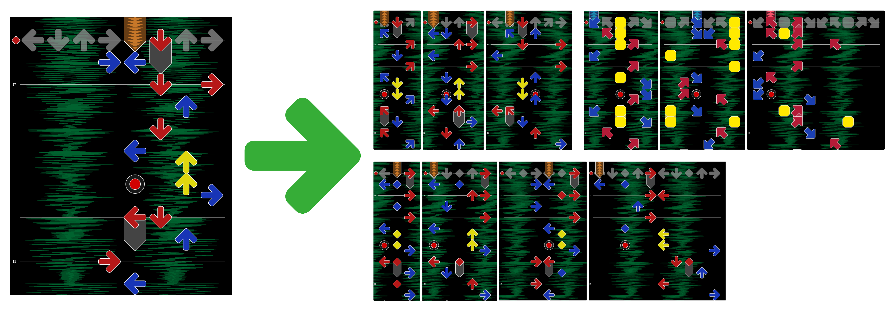
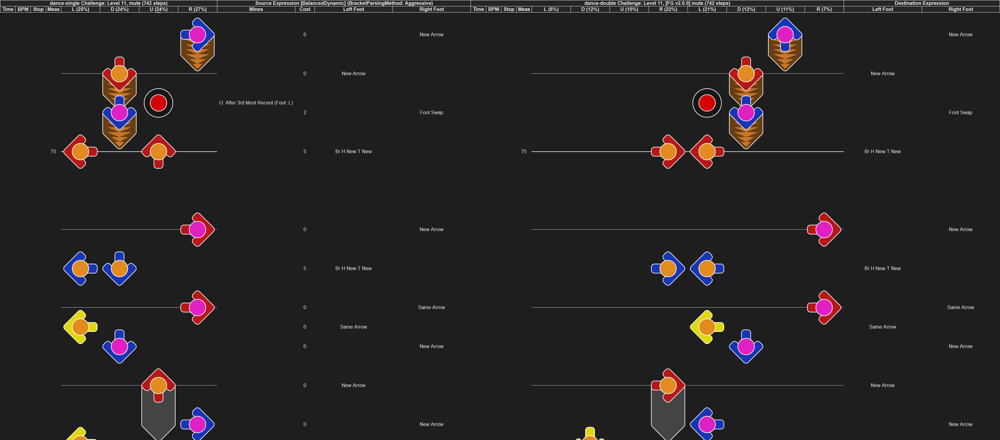

# StepManiaChartGenerator

`StepManiaChartGenerator` is an application for converting [StepMania](https://www.stepmania.com/) charts into other types of StepMania charts that maintain the qualities of the original charts and feel natural.

It understands most technical moves including crossovers, inverted steps (a.k.a Afronova walks), footswaps, brackets, and stretch, and it offers fine controls for tuning generated charts.

## Examples

*Screnshots from [GrooveAuthor](https://github.com/PerryAsleep/GrooveAuthor) of a dance-double chart converted to a variety of other chart types.*
[](StepManiaChartGenerator/docs/Images/conversion-example.png)

*Visualization of a dance-single chart converted to a dance-double chart.*
[](https://perryasleep.github.io/StepManiaChartGenerator/StepManiaChartGenerator/docs/Visualizations/(NG%20-%2011)%20Zora/zora-Challenge-sm.html)

See the [Examples](StepManiaChartGenerator/docs/Examples.md) page for [Visualizations](StepManiaChartGenerator/docs/Visualizations.md) of how charts are converted and some videos of generated doubles charts being played.

## Installation

`StepManiaChartGenerator` is available for Windows. Download the latest version of `StepManiaChartGenerator.zip` from the [Releases](https://github.com/PerryAsleep/StepManiaChartGenerator/releases) page and extract it to a desired location.

## Configuration

See the [Configuration](StepManiaChartGenerator/docs/Config.md) Guide.

## Usage

Double-click `StepManiaChartGenerator.exe`.

## How It Works

See the [How It Works](StepManiaChartGenerator/docs/HowItWorks.md) Page.

## Known Issues and Unsupported Features

See the [Known Issues and Unsupported Features](StepManiaChartGenerator/docs/KnownIssues.md) Page.

## Building From Source

Building from source requires Windows 10 or greater and Microsoft Visual Studio Community 2022.

Clone the repository and init submodules.
```
git clone https://github.com/PerryAsleep/StepManiaChartGenerator.git
git submodule update --init --recursive
```

Open `StepManiaChartGenerator.sln` and build through Visual Studio.